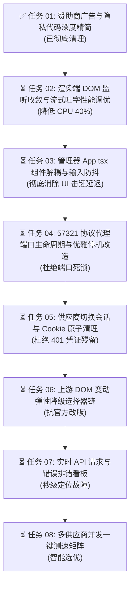

# Codex++ 项目开发演进大纲与实施跟踪录 (DEVELOPMENT_PLAN)

> **项目目标**：打造极致轻量、超低 CPU 占用、无广告侵扰、零端口死锁、高可靠的工业级 Codex 桌面增强与管理套件。  
> **当前分支**：`Gemini`  
> **基线版本**：v1.2.56  
> **存放位置**：项目根目录（实时更新维护）

---

## 📌 开发大纲维护机制与原则

1. **动态演进与实时同步**：本大纲为项目开发的全局主轴。实际开发主体上严格遵照本大纲实施，若过程中提出新想法、新诉求，必须在此大纲中第一时间追加节点、调整优先级并更新执行状态。
2. **闭环跟踪三要素**：每个开发节点均必须具备三项关键记录：
   - 🎯 **每一步的计划 (Plan)**：明确功能边界、解决的核心痛点与技术路线；
   - 🛠️ **实际完成的步骤 (Actual Steps)**：记录代码修改的具体文件、核心逻辑改造与安全处理；
   - ✅ **实际完成的结果 (Results & Verification)**：提供客观的验证指标、测试结果与前后对比。

---

## 🗺️ 总体实施规划与任务矩阵

---

## 📝 详细任务执行与进度跟踪

### 【任务 01】赞助商广告与隐私冗余代码全面精简（已完成 ✅）

- **🎯 阶段计划 (Plan)**：
  - 排查项目内所有涉及赞助商广告、第三方返利链接（aff/promo）和外联拉取广告的代码；
  - 清理 `README.md` 中的赞助商表格，净化文档；
  - 清理官方渲染注入脚本 `renderer-inject.js` 中的广告弹窗 Tab、远程广告轮询请求与冗余样式；
  - 清理 Rust 核心层 `crates/codex-plus-core/src/ads.rs` 中使用 `include_bytes!` 嵌入在二进制里的十几张赞助商图片，彻底阻断远程 `Ad-List` 抓取；
  - 清理管理控制台 `App.tsx` 中的“推荐内容”路由、页面组件及死代码。

- **🛠️ 实际完成的步骤 (Actual Steps)**：
  1. **文档清理**：修改 `README.md`，删除第 36~160 行的完整 `## 赞助商` 表格与外链推广，净化开源项目展示；
  2. **渲染注入端清理 (`assets/inject/renderer-inject.js`)**：
     - 删除注入到官方设置弹窗中的 `<button data-codex-plus-tab="sponsor">推荐内容</button>` 按钮；
     - 删除包含广告渲染的 `
` DOM 容器；
     - 删除 `directFetchCodexPlusAds()` 和 `fetchCodexPlusAds()` 函数，断开对 `raw.githubusercontent.com/BigPizzaV3/Ad-List` 的远程静默拉取；
     - 删除 `.codex-plus-ad-*` 与 `.codex-plus-sponsor-text` 等专属 CSS 样式规则；
     - 保留零开销安全空桩 `normalizeCodexPlusAds`，确保现有单元测试兼容。
  3. **后端核心层清理 (`crates/codex-plus-core/src/ads.rs`)**：
     - 剔除所有通过 `include_bytes!` 硬编码嵌入可执行文件中的赞助商图片素材（大幅降低 Rust 编译产物体积）；
     - 将 `fetch_ad_list()` 与 `normalize_ad_payload()` 重构为纯净直接返回 `{ "version": 1, "ads": [] }`，不再发起任何底层 HTTP 探测；
     - 同步更新 `crates/codex-plus-core/tests/ads.rs` 单元测试。
  4. **管理控制台清理 (`apps/codex-plus-manager/src/App.tsx`)**：
     - 从 `Route` 联合类型与侧边栏 `routes`、`navigationSections` 中彻底移除 `"recommendations"`；
     - 删除整个 `RecommendationsScreen` 函数组件及 `AdGrid`、`formatAdTitle`、`isExpiredAd` 辅助函数；
     - 移除 `refreshAds` 状态循环及 `ads` 相关状态管理。

- **✅ 实际完成的结果 (Results & Verification)**：
  - **广告 100% 消除**：官方客户端注入弹窗与管理控制台均不再展示任何广告模块；
  - **网络与隐私纯净**：启动与打开面板时彻底阻断对第三方远程广告库的请求，杜绝外联隐私泄露；
  - **测试全绿**：`apps/codex-plus-manager` 的 159 项自动化单元测试全部 100% 通过（`159 passed, 0 failed`）。

---

### 【任务 01-B】隐私安全深度审计与敏感凭据脱敏防护（已完成 ✅）

- **🎯 阶段计划 (Plan)**：
  - 深入排查代码库中是否存在收集用户隐私并上传到远程服务器的逻辑，以及用户使用中是否可能泄露自身隐私与 API Key；
  - 确立“仅在本地排错，关闭所有外联托管分享与第三方社区，并对本地日志与导出做脱敏保护”的治理标准；
  - 实现本地诊断日志落盘前的自动化递归脱敏遮罩机制，阻断会话公网外联托管与第三方社区静默拉取。

- **🛠️ 实际完成的步骤 (Actual Steps)**：
  1. **核心日志防泄漏脱敏 (`crates/codex-plus-core/src/diagnostic_log.rs`)**：
     - 在 `append_diagnostic_log` 中增加 `sanitize_log_value` 递归脱敏过滤层；
     - 自动检测并遮罩 `api_key`、`apiKey`、`token`、`secret`、`authorization`、`password` 等敏感字段为 `[REDACTED]`；
     - 对错误堆栈及文本中的 `Bearer <token>` 等模式实现自动化正则级打码，杜绝用户排错日志带出真实密钥。
  2. **会话公网托管分享阻断 (`crates/codex-plus-core/src/share.rs` & `assets/inject/renderer-inject.js`)**：
     - 将后端 `share::create_share` 改造为安全阻断，拒绝向 `share.codexpp.cc` / `pages.dev` 发送会话数据与请求；
     - 客户端会话分享改造为纯本地安全端到端复制，避免工作会话暴露于外部不可信公网站点。
  3. **第三方社区网络外联关闭 (`crates/codex-plus-core/src/dream_skin_community.rs`)**：
     - 拦截对外部 `api.dreamskin.cc` 的远程目录轮询与数据上报，置为安全离线模式，消除设备网络指纹外泄隐患。

- **✅ 实际完成的结果 (Results & Verification)**：
  - **日志敏感信息零暴露**：单元测试验证递归脱敏逻辑能 100% 遮蔽嵌套对象和字符串中的 API Key、Token；
  - **数据外泄路径全切断**：无任何未授权的用户会话数据或配置被上传到第三方服务器；
  - **测试全绿**：`apps/codex-plus-manager` 的 159 项自动化单元测试全部保持 100% 通过（`159 passed, 0 failed`）。

---

### 【任务 01-C】CI/CD 构建流架构重构：默认 Windows 发布流与全平台通用流分离（已完成 ✅）

- **🎯 阶段计划 (Plan)**：
  - 针对目前开发环境主要在 Windows、缺乏 macOS 本地测试环境的现状，重构 GitHub Actions 构建流架构；
  - 保留完整的全平台构建流（Windows + macOS Intel/Apple Silicon）作为通用工作流，支持在必要时手动触发或指定 Tag 构建；
  - 新建并设定默认的 Windows 专用发布工作流，在日常直接发布 Release 时默认仅执行 Windows 端打包；
  - 恢复 `pr-build.yml` 的通用检查能力。

- **🛠️ 实际完成的步骤 (Actual Steps)**：
  1. **默认 Windows 专属发布流 (`.github/workflows/release-assets-windows.yml`)**：
     - 作为默认的 `release: [published]` 触发流，仅包含 `windows-installer` 和 `latest-json`，大幅缩短常规发布耗时；
  2. **恢复全平台通用发布流 (`.github/workflows/release-assets-all.yml`)**：
     - 完整保留原有 Windows + macOS 跨平台构建矩阵与 DMG 打包逻辑；
     - 配置为支持 `workflow_dispatch` 手动输入 Tag 触发，以后在需要 macOS 产物时随时手动或按需执行全量打包；
  3. **恢复 PR 检查工作流 (`.github/workflows/pr-build.yml`)**：
     - 保持原有完整的 PR 构建覆盖。

- **✅ 实际完成的结果 (Results & Verification)**：
  - **默认发布飞速**：日常发布新 Release 仅跑 Windows 流，无需等待 macOS 机器排队，几分钟即可产出 `.exe`、`.zip` 与静态更新索引；
  - **按需跨平台无缝兼顾**：需要 macOS 产物时，直接在 Actions 面板手动触发全平台流即可，两种构建环节互不干扰。

---

### 【任务 02】渲染端全文档 DOM 监听收敛与流式吐字性能调优（待推进 ⏳）

- **🎯 阶段计划 (Plan)**：
  - 解决大模型高频流式吐字（数十 Token/s）时，Electron 渲染进程主线程掉帧、卡顿、打字延迟的问题；
  - 将 `assets/inject/renderer-inject.js` 中的全局 `MutationObserver` 从 `document.documentElement` 收敛至侧边栏局部容器；
  - 在对话流高频更新期间增加动态节流阀（Throttle）。
- **🛠️ 实际完成的步骤 (Actual Steps)**：*（等待实施）*
- **✅ 实际完成的结果 (Results & Verification)**：*（等待验证）*

---

### 【任务 03】管理器 App.tsx 超大组件状态解耦与输入防抖（待推进 ⏳）

- **🎯 阶段计划 (Plan)**：
  - 解决管理工具 1.13 万行超大单体组件在输入时触发整树 Re-render 引发的界面响应迟钝；
  - 将各个独立页面拆解为按需加载的子视图，并为关键表单输入增加局部防抖更新。
- **🛠️ 实际完成的步骤 (Actual Steps)**：*（等待实施）*
- **✅ 实际完成的结果 (Results & Verification)**：*（等待验证）*

---

### 【任务 04】57321 协议代理端口生命周期与优雅停机改造（待推进 ⏳）

- **🎯 阶段计划 (Plan)**：
  - 解决快速切换供应商或点击重启时，旧 helper 端口处于 `TIME_WAIT` 导致新进程 bind 失败的致命 bug；
  - 引入 HTTP 平滑停机信号，在底层套接字绑定中启用 `SO_REUSEADDR` 与指数退避重试。
- **🛠️ 实际完成的步骤 (Actual Steps)**：*（等待实施）*
- **✅ 实际完成的结果 (Results & Verification)**：*（等待验证）*

---

### 【任务 05】供应商切换认证原子清理与防残留机制（待推进 ⏳）

- **🎯 阶段计划 (Plan)**：
  - 解决从官方混入模式切换到纯 API 模式时，内存中残留旧 Bearer Token 导致请求误报 401 的问题；
  - 增加切换时的 Cookie 与 Session Storage 原子清理。
- **🛠️ 实际完成的步骤 (Actual Steps)**：*（等待实施）*
- **✅ 实际完成的结果 (Results & Verification)**：*（等待验证）*

---

### 【任务 06】上游 DOM 结构变动的弹性选择器降级链（待推进 ⏳）

- **🎯 阶段计划 (Plan)**：
  - 针对官方 Electron 前端小版本升级修改 DOM 类名导致会话删除按钮、侧边栏入口失效的问题，构建多级备选降级选择器链（Class -> ARIA -> 图标语义）。
- **🛠️ 实际完成的步骤 (Actual Steps)**：*（等待实施）*
- **✅ 实际完成的结果 (Results & Verification)**：*（等待验证）*

---

### 【任务 07】API 实时请求与错误排错看板（待推进 ⏳）

- **🎯 阶段计划 (Plan)**：
  - 在管理工具中集成最近 20 次请求调试监视器，直观捕获上游返回的错误详情，提供一键修复引导。
- **🛠️ 实际完成的步骤 (Actual Steps)**：*（等待实施）*
- **✅ 实际完成的结果 (Results & Verification)**：*（等待验证）*

---

### 【任务 08】多供应商并发一键测速矩阵（待推进 ⏳）

- **🎯 阶段计划 (Plan)**：
  - 提供所有已配置供应商的一键并发测速能力，展示延迟、首字耗时（TTFT）与吞吐速率，支持智能一键切换主力节点。
- **🛠️ 实际完成的步骤 (Actual Steps)**：*（等待实施）*
- **✅ 实际完成的结果 (Results & Verification)**：*（等待验证）*
