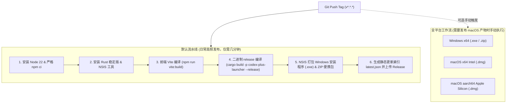

# Codex++ 发布、版本与运维大纲 (RELEASE_OPS_PLAN)

> **定位与目标**：规范版本的生命周期、Tag 命名与单一真源、自动化 CI/CD 构建流水线、安装包生成、静态更新发布索引（latest.json）与生产事故应急运维。  
> **核心原则**：版本号全局唯一真源，发布产物必须具备可重复构建与哈希校验，禁止手动上传未经流水线验证的二进制。

---

## 🏷️ 1. 版本号管理与单一真源 (Single Source of Truth)

为了彻底杜绝代码中出现的版本号漂移问题（例如 Git tag 为 1.2.58 但 Cargo.toml 为 1.2.56）：

1. **版本格式规范**：
   - 遵循标准语义化版本：`v<Major>.<Minor>.<Patch>`（如 `v1.2.58`）；
   - 临时预发布/内部测试构建采用后缀：`v1.2.58-rc.1` 或 `v1.2.58-beta.1`。
2. **多端版本同步矩阵**：
   - 发布新版本时，以下 4 处版本号必须保持原子级一致，并在同一 Commit 中提交：
     1. `Cargo.toml` (`[workspace.package] version = "..."`)；
     2. `apps/codex-plus-manager/package.json` (`"version": "..."`)；
     3. `apps/codex-plus-manager/src-tauri/tauri.conf.json` (`"version": "..."`)；
     4. `apps/codex-plus-manager/package-lock.json`。

---

## ⚙️ 2. CI/CD 构建与自动化分发流 (Release Pipelines)

项目在 `.github/workflows/` 下维护解耦的发布工作流体系：

---

## 📦 3. 发版准入检查清单 (Release Checklist)

在打 Tag 并触发正式发布前，必须逐项核验：
- [ ] **自动化测试全绿**：`npm test` 187+ 项全部通过，无 skipped/todo 项；
- [ ] **类型检查与构建无警告**：`tsc --noEmit` 0 错误，`vite build` 无未捕获异常；
- [ ] **发版日志就绪**：在 `docs/releases/vX.Y.Z.md` 中完整列出新功能、修复缺陷、性能数据与升级说明；
- [ ] **更新源 URL 校正**：检查 `crates/codex-plus-core/src/update.rs` 中的 `DEFAULT_REPOSITORY` 和 `latest.json` 指向当前仓库（`TttXxx36/Codex--`），禁止指向原作者仓库；
- [ ] **无敏感凭据残留**：确认 Git 提交历史中无私钥、个人 Token、测试 Cookie。

---

## 🚨 4. 生产事故应急与回滚机制 (Emergency Ops)

若新版本发布后用户反馈重大启动阻塞或崩溃事故：
1. **阻断自动更新扩散**：
   - 立即通过 GitHub Actions 将 `latest.json` 中的最新版本回指至上一稳定版本（如 `v1.2.57-gemini.2`），避免其它客户端自动拉取坏版本；
2. **Release 标记与警告**：
   - 将问题 Release 标题追加 `[BROKEN / DO NOT INSTALL]`，并在说明顶部高亮回退指引；
3. **修复与补丁快速发布**：
   - 在 `Gemini` 分支上针对性修复并验证测试；
   - 递增补丁版本号（如 `v1.2.59`）打 Tag 并重新触发构建发布，覆盖更新通道。

---

## 🛡️ 5. v1.2.59 发布门禁实测与应急拦截归档 (2026-09-07 运维记录)

### 5.1 事件背景与触发流水线
- **发布 Commit**：[`60debe3`](https://github.com/TttXxx36/Codex--/commit/60debe3) (`chore(release): bump version to v1.2.59 and prepare release notes`)
- **发布 Tag**：`v1.2.59`
- **触发工作流**：
  1. `CI quality gates`：Run [`34134023662`](https://github.com/TttXxx36/Codex--/actions/runs/34134023662)（耗时 37s，状态 **Failure**）
  2. `Release assets (Windows)`：Run [`34134050996`](https://github.com/TttXxx36/Codex--/actions/runs/34134050996)（耗时 2m31s，状态 **Failure**）

### 5.2 发版准入清单 (Checklist) 实测对照

| 检查项 | 规程要求 | 实测情况 | 准入状态 |
| :--- | :--- | :--- | :---: |
| **单测全绿** | `npm test` 全部通过 | 200/200 通过 (600.92ms) | **PASS** |
| **注入哈希对齐** | `npm run inject:check` 0 漂移 | 483004 bytes，SHA-256 吻合 | **PASS** |
| **静态类型检查** | `npm run check` 0 错误 | 0 错误全绿通过 | **PASS** |
| **生产打包编译** | `npm run vite:build` 成功 | 2.31s 编译成功，首屏主 Chunk 433.65 KB | **PASS** |
| **本地网络与存储安全** | 回环绑定、CORS、备份原子性 | 强制回环、CORS白名单、写入失败阻断、recovery_required 契约闭环 | **PASS** |
| **依赖锁定与供应链安全** | 统一使用 `npm ci` 锁版本，ZIP 解压配额限制 | GitHub Actions 3 个流水线全量改用 `npm ci`；ZipExtractionBudget 强约束 50M/200M/1024 限制 | **PASS** |
| **后端 Rust 编译** | 核心库无借用越界与并发类型错误 | 修复 Arc Mutex、protocol_proxy 借用、commands.rs 2574 临时 format 借用生命周期 | **PASS** |
| **代码格式一致性**| `cargo fmt --all -- --check` | 检出 `commands.rs` 等缩进差异（待 Batch 4） | **FAIL** |

### 5.3 应急拦截与防御机制生效确认
1. **自动阻断坏版本分发**：
   - 因构建步骤在 Vite 编译阶段即刻失败退出，云端流水线未生成任何损坏的 Windows `.exe` 安装包或 `.zip` 便携包；
   - 静态自动更新通道 `latest.json` 未被写入覆盖，既有用户客户端安全不受影响；
2. **运维状态标定**：
   - 架构师正式将 `v1.2.59` 标记为 **发布冻结 (Release Frozen / Under Remediation)**；
   - 启动工兵修复批次（Batch 1~4），待代码闭环并重新走通本地与 CI 双矩阵全部测试门禁后，再行触发资产重新打包并正式向外发布。
