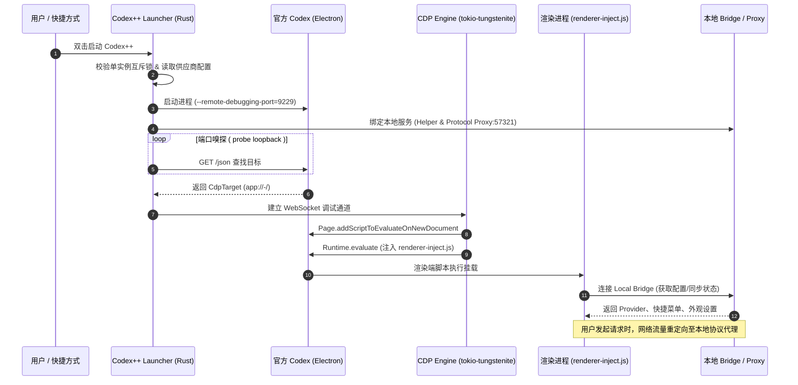
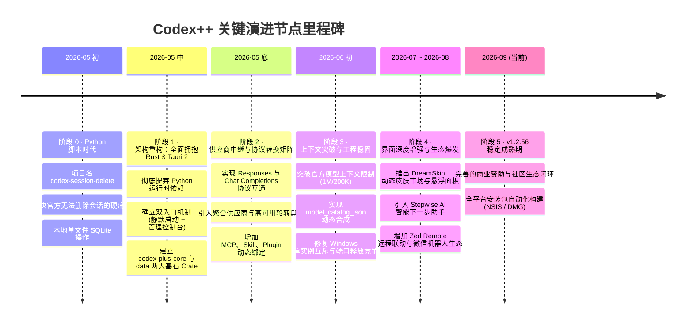

# Codex++ (Codex加加) 全景架构与工程深度分析评估报告

> **项目名称**：Codex++ (原 codex-session-delete)  
> **当前版本**：v1.2.56 (Rust Edition 2024 / Tauri 2.x)  
> **复刻仓库**：[https://github.com/TttXxx36/Codex--](https://github.com/TttXxx36/Codex--)  
> **报告类型**：架构全景解剖、关键演进节点评估与未来演进路线图

---

## 1. 项目定位与核心价值

Codex++ 是专为 OpenAI 官方 Codex / ChatGPT Electron 桌面客户端打造的**外部启动器、高级配置网关与全功能体验增强套件**。

在官方桌面应用的使用过程中，全球开发者普遍面临若干关键痛点：
1. **官方账号配额限制与多模型接入困难**：无法原生接入第三方兼容 API（如 DeepSeek、Claude、Gemini、本地部署模型），官方设置中缺乏透明中转机制。
2. **缺乏多供应商负载均衡**：无法在多个中转供应商或不同 API 节点间平滑实现故障转移（Failover）或按请求/会话轮转（Round-Robin）。
3. **上下文窗口与模型目录死锁**：官方客户端硬编码了模型上下文上限和压缩阈值，无法使用自定义的 1M / 200K 超长上下文窗口。
4. **会话治理缺失**：官方应用长期缺乏本地会话批量删除、导出为 Markdown、以及跨供应商会话备份/恢复的能力。
5. **网络与交互体验瑕疵**：启动时受 Statsig 云端配置阻断导致白屏卡顿、富文本粘贴格式混乱、插件市场与模型白名单受限、缺乏中文原生支持等。

Codex++ 的核心技术突破在于实现了**完全无侵入式（Non-invasive）挂接**：
- **不修改任何官方二进制与 `app.asar` 文件**；
- **不向官方安装目录写入任何补丁或 hook 文件**；
- 基于 **Chromium DevTools Protocol (CDP)** 动态连接渲染进程，通过本地 Rust 核心桥接（Local Bridge & Proxy）实现功能挂载。即使卸载或停用 Codex++，官方 Codex 应用也能完好如初。

---

## 2. 总体系统架构与工程拓扑

Codex++ 采用“**双桌面入口 + Rust 核心守护与网关 + 注入式渲染增强 + Tauri 现代化管理控制台**”的分层协同架构。

### 2.1 架构拓扑图 (Mermaid)

```mermaid
graph TB
    subgraph User Desktop ["用户桌面交互层"]
        E1["🚀 Codex++ (静默启动入口)"]
        E2["⚙️ Codex++ 管理工具 (Tauri GUI)"]
    end

    subgraph Launcher Layer ["启动器与生命周期守护"]
        LauncherApp["apps/codex-plus-launcher<br/>(无窗口后台进程)"]
        Watchdog["CDP Watchdog & Bridge Reinjector<br/>(掉线监测与重连)"]
    end

    subgraph Official App ["官方桌面应用层 (Electron)"]
        OfficialExe["Codex / ChatGPT Desktop<br/>(--remote-debugging-port)"]
        subgraph WebContents ["渲染进程 (app://-/)"]
            InjectedScript["renderer-inject.js (10k+ LOC)<br/>• 菜单扩展 • 粘贴修复 • 快速启动<br/>• 会话操作 • 悬浮面板 • 皮肤引擎"]
            FloatingPanel["Floating Panel / Stepwise<br/>(AI下一步建议 & 悬浮助手)"]
        end
    end

    subgraph Rust Core Layer ["Rust 核心能力层 (crates/codex-plus-core)"]
        CDP["CDP Client (WebSocket/JSON)<br/>(Target识别、Script注入)"]
        LocalBridge["Local HTTP/WS Bridge<br/>(跨进程通信、命令中继)"]
        ProtoProxy["Protocol Proxy (Port: 57321)<br/>(Responses ↔ Chat Completions 转换)"]
        RelayEngine["Relay Routing & Rotation<br/>(Failover、会话/请求轮转)"]
        ModelCatalog["Model Catalog Synthesizer<br/>(动态生成上下文配置 JSON)"]
    end

    subgraph Data & Storage Layer ["数据与本地存储 (crates/codex-plus-data)"]
        SQLiteAdapter["SQLite Storage Adapter<br/>(~/.codex/sqlite/*.db / state_5.sqlite)"]
        BackupStore["Backup & Undo Store<br/>(~/.codex-session-delete/)"]
        ProviderSync["Provider Sync Engine<br/>(Rollout / metadata / auth.json 同步)"]
    end

    subgraph Upstream AI Services ["上游 AI 服务生态"]
        OpenAIOfficial["OpenAI 官方服务"]
        ThirdPartyAPI["第三方兼容 API<br/>(DeepSeek / Claude / OneAPI / NewAPI)"]
    end

    E1 -->|双击静默运行| LauncherApp
    E2 -->|双击打开面板| apps/codex-plus-manager
    LauncherApp -->|1. 拉起带 CDP 参数进程| OfficialExe
    LauncherApp -->|2. 建立 CDP 调试连接| CDP
    CDP -->|3. 注入脚本到上下文| InjectedScript
    LauncherApp -->|4. 维持重连守护| Watchdog

    InjectedScript <-->|HTTP / WebSocket 通信| LocalBridge
    LocalBridge <--> Rust Core Layer
    
    OfficialExe -->|模型请求路由到本地代理| ProtoProxy
    ProtoProxy -->|按策略路由/负载均衡| RelayEngine
    RelayEngine -->|官方认证协议| OpenAIOfficial
    RelayEngine -->|Chat Completions / Responses| ThirdPartyAPI

    LocalBridge <--> SQLiteAdapter
    LocalBridge <--> BackupStore
    LocalBridge <--> ProviderSync
```

### 2.2 核心代码组织结构

项目采用标准的高效 Rust Cargo Workspace + 前端现代化架构管理：

```text
Codex--/
├── Cargo.toml                    # Rust 工作区根配置 (Rust 1.85+, Edition 2024)
├── apps/
│   ├── codex-plus-launcher/      # [启动器] 无窗口静默启动入口 (windows_subsystem="windows")
│   └── codex-plus-manager/       # [管理台] Tauri 2 + React 19 + TypeScript + Vite 客户端
│       ├── src/                  # 16 大功能面板、状态管理与测试用例
│       └── src-tauri/            # Tauri 2 运行时，桥接 codex-plus-core 指令
├── crates/
│   ├── codex-plus-core/          # [核心库] 启动引擎、CDP控制器、协议转换代理、中继路由
│   └── codex-plus-data/          # [数据库] SQLite解析、会话备份、Markdown导出、元数据同步
├── assets/
│   ├── inject/                   # 注入到官方渲染端的增强脚本 (renderer-inject.js 等)
│   ├── images/                   # 图标、各主流模型中转赞助商视觉素材
│   └── plugin-marketplaces/      # 插件市场精选离线包
├── services/
│   └── share-site/               # Cloudflare Workers 会话分享静态站服务
├── tools/
│   ├── codex-wechat/             # 微信接入桥接 Python 机器人
│   └── i18n-verify.mjs           # 国际化文案比对与验证脚本
├── scripts/
│   └── installer/                # Windows NSIS 安装打包与 macOS DMG 构建脚本
└── docs/                         # 详细的技术规范 (specs)、开发计划 (plans) 与调研记录
```

---

## 3. 关键技术机制深度剖析

### 3.1 零侵入 CDP 注入与生命周期守护

传统的 Electron 客户端增强往往需要解包官方 `app.asar`、替换 preload 脚本或安装注入 DLL。这种方式极易受到官方版本升级破坏，且存在合规与防篡改风险。

Codex++ 采用了革命性的外部驱动机制：
1. **进程唤醒与端口嗅探**：
   - 自动检测系统中已安装的官方应用路径（Windows 的 `%LOCALAPPDATA%\Programs\codex`，macOS 的 `/Applications/Codex.app`）。
   - 为避免端口冲突，动态分配或绑定安全的本地环回端口（Loopback Port），传入 `--remote-debugging-port=<port>` 参数拉起官方应用。
2. **CDP 目标锁定与验证**：
   - 通过 `http://127.0.0.1:<port>/json` 查询目标，严格校验目标 URL 是否为官方应用的特征协议：`app://-/`。
   - 建立安全 WebSocket 连接，使用 `Page.enable`、`Runtime.enable`。
3. **双重注入机制**：
   - 针对当前已打开的页面：通过 `Runtime.evaluate` 立即执行注入脚本。
   - 针对后续新建标签页/页面刷新：通过 `Page.addScriptToEvaluateOnNewDocument` 注册启动时注入脚本。
4. **Watchdog 探活与自愈**：
   - 核心守护线程不断检测官方渲染窗口的健康状况。当用户在官方界面按 `Ctrl+R` / `Cmd+R` 刷新导致环境重置时，Watchdog 会在数百毫秒内感知并自动重新注入桥接通道。



### 3.2 现代化协议转换代理网关 (`protocol_proxy.rs`)

OpenAI Codex 客户端与后端通信使用的是专门的 **Responses API** 协议，而市面上主流大模型（DeepSeek、GLM、Claude、自建 OneAPI 等）大多仅提供标准的 OpenAI **Chat Completions API**。

Codex++ 在核心层内置了一个高达 4,600+ 行的高性能双向转换网关（默认监听 `127.0.0.1:57321`）：
- **请求端转换（Responses -> Chat Completions）**：
  - 将 Codex 的富交互结构、上下文历史、多轮对话转换为标准 `messages` 数组；
  - 精确映射 Codex 的各种特殊补丁工具：`add_file`、`delete_file`、`update_file`、`replace_file`、`batch` 为标准 Tool Calls；
  - 适配不同的推理模型思考链格式（支持 `DeepSeek` `<think>` 标签剥离/保留、`OpenRouter` reasoning 字段、`LowHigh` 格式等）。
- **响应端流式重构（SSE Stream Transformer）**：
  - 实时捕获上游返回的 SSE 流，将 `delta.content` 或 `delta.reasoning_content` 重新封装为 Codex 渲染端能够无缝解析的 Responses SSE 事件流。
  - 处理心跳超时保持、错误码本地拦截与友好提示转换。

### 3.3 四大供应商模式与聚合负载均衡系统

Codex++ 彻底理清了官方凭据与第三方 API 的边界，设计了 4 种互不污染的供应商模式：

| 模式 | 运行机制 | 认证隔离边界 | 适用场景 |
| :--- | :--- | :--- | :--- |
| **官方登录** | 纯净使用 OpenAI 官方账号与订阅 | 清除自定义 API 配置，严格保留官方登录 Cookie/Token | 消耗官方订阅额度，原汁原味体验 |
| **官方登录 + API 混入** | 保留官方账号的 UI 入口与插件市场，但**所有模型生成请求全部重定向至第三方 API** | API Key 写入自定义 Bearer Token，绝不覆写官方 `auth.json` | 既享受官方 UI 与插件，又使用廉价稳定第三方算力 |
| **纯 API** | 完全不依赖官方账号，彻底离线使用自定义 Base URL & Key | 独立生成 `config.toml`，避免官方 Token 干扰 | 无官方账号用户、内网或企业私有化模型接入 |
| **聚合供应商 (Aggregate)** | 在多个 API 供应商之上构建虚拟路由网关 | 统一管理多节点密钥，上游透明 | 追求极致高可用、跨厂商备灾分流 |

#### 聚合路由策略引擎
针对聚合供应商，系统内置了 4 种智能调度算法：
1. **故障转移 (Failover)**：保持优先级队列，首选可用节点；发生网络超时或 5xx 错误时秒级无感降级到下一节点。
2. **按会话轮转 (Conversation Round Robin)**：同一个 Conversation 线程绑定在固定供应商上，避免不同模型由于风格差异导致上下文认知混乱。
3. **按请求轮转 (Request Round Robin)**：每次 prompt 请求轮流派发，适用于多账号均摊额度与并发限制。
4. **权重轮转 (Weighted Round Robin)**：根据设定的整数权重比例分发请求，适合“主算力为主，备用算力辅助”的配比场景。

### 3.4 动态模型目录合成与 1M 超长上下文突破

Codex 客户端原生对于上下文窗口有强校验。Codex++ 实现了 `model_catalog.rs` 动态配置合成器：
- 用户可在管理工具中自由为每个模型指定上下文上限（如 `1M`、`200K`、`128K` 或纯数字）以及自动触发上下文压缩的百分比阈值。
- 启动时自动将配置合成输出至 `model_catalog_json`，并注入客户端的环境变量与配置文件中。
- 彻底解决了历史版本中将 `deepseek-v4[1M]` 等后缀拼在模型名称中导致的历史会话污染问题（通过独立的 `model_windows` JSON Map 分离存储）。

### 3.5 底层 SQLite 直读与安全会话治理 (`codex-plus-data`)

官方 Codex 本地采用 SQLite 存储历史会话记录（旧版本位于 `~/.codex/state_5.sqlite`，新版本迁移至 `~/.codex/sqlite/*.db`）。
- **跨版本数据库适配**：`SQLiteStorageAdapter` 具备动态 Schema 识别能力，自适应不同版本的数据表结构。
- **软删除与可逆恢复机制**：
  - 遵循严格的数据安全准则，删除会话前自动在 `~/.codex-session-delete/` 创建备份快照；
  - 提供单会话删除、多选批量删除、带条件筛选的清理能力，并支持从快照无损恢复。
- **Markdown 结构化导出**：深度解析存储中的多轮对话、代码块、思考过程，一键导出为标准的 GitHub 规范 Markdown 文档。

### 3.6 渲染层极致体验优化 (`renderer-inject.js`)

在 1 万余行的注入脚本中，蕴藏了大量极其巧思的逆向与前端工程优化：
- **Statsig 快速启动劫持 (`installCodexPlusFastStartup`)**：官方应用启动时会向云端数十个分析打点与灰度测试域名（如 `ab.chatgpt.com`、`statsigapi.net`）发起阻塞性网络请求，网络稍有延迟即白屏卡死数秒。Codex++ 注入代码重写 `fetch` 并劫持 `__STATSIG__` 客户端，将超时时间压缩至百毫秒内并直接 mock Ready 状态，使**启动速度实现数倍跃升**。
- **富文本粘贴净化 (`installCodexPlusPasteFix`)**：拦截编辑器 Paste 事件，清洗剪贴板中的冗余富文本/HTML 样式标签，保证代码粘贴时缩进与纯文本的纯净度。
- **插件市场与模型白名单解锁**：绕过官方针对特定区域或特定计划的灰度阻断，强制开启全量插件浏览与自定义模型选择。
- **DreamSkin 皮肤渲染引擎**：支持 Windows/macOS 视觉材质、自选二次元/自然壁纸、透明毛玻璃特效与悬浮伴侣形象。

---

## 4. 关键演进节点与开发里程碑回顾

通过审查项目历史文档（`docs/superpowers/plans/`、`specs/`、`CHANGELOG.md`），Codex++ 的演进历程展现出极度清晰的技术驱动路径：



---

## 5. 项目优劣势、潜在风险与技术债务评估

### 5.1 显著技术优势

1. **架构设计极具先锋性（Non-invasive Hijacking）**：
   - 不修改官方文件，免受杀毒软件或官方完整性校验告警，升级官方应用后依然稳健。
2. **运行性能与资源占用极致优化**：
   - 纯 Rust 核心 + Tauri 2 架构，内存占用低至数十 MB，冷启动几乎瞬时完成。
3. **协议兼容性处理深入极致**：
   - 对 Tool Call、Patch 映射、流式思考链的兼容性经过大量工业级 API 验证，成熟度远超同类玩具脚本。
4. **功能闭环度极高**：
   - 从底层的网络代理、模型列表合成，到界面的会话管理、插件解锁、个性化皮肤，覆盖了全方位的痛点需求。

### 5.2 潜在痛点与技术债务

1. **单文件代码量过大，亟待组件化解耦**：
   - `apps/codex-plus-manager/src/App.tsx` 超过 **11,300 行**，将 16 大路由视图、数百个状态变量杂糅在单一组件中，可读性与团队协作成本极高。
   - `assets/inject/renderer-inject.js` 超过 **10,600 行**，包含纯前端 JavaScript 的大型 IIFE 混写，缺乏模块化打包构建（如 Rollup/ESBuild）与类型保障。
2. **对官方 DOM 与内部接口存在脆弱依赖（DOM Coupling）**：
   - 界面增强功能（如展开按钮文案、菜单位置、输入框选择器）强依赖官方 Electron 页面当前的 DOM 类名与结构。一旦 OpenAI 官方前端进行 React 结构重构，部分注入特性可能瞬间失效。
3. **协议端口固定导致的潜在冲突**：
   - 协议转换网关端口写死为 `57321`（因官方 `config.toml` 需要指定 Base URL）。尽管代码中增加了重试与占位等待逻辑，但在进程异常退出或多实例竞争时仍存在偶发端口冲突隐患。
4. **Linux 平台支持缺失**：
   - 当前项目重点打磨了 Windows (NSIS) 与 macOS (DMG)，未针对 Linux（AppImage/Deb）提供自动化打包与路径适配。
5. **自动化集成测试（E2E）覆盖率有待加强**：
   - 现有测试主要集中在 Rust 单测和前端局部 helper 单测，缺乏模拟真实 Electron/CDP 行为的端到端自动化测试管线。

---

## 6. 后续开发与持续完善路线图建议

针对该项目的后续开发，建议分阶段按以下战略路线推进：

### 第一阶段：工程解耦与重构（提升代码可维护性）
- [ ] **前端管理控制台解耦**：将 `App.tsx`（1.1 万行）按 16 个功能模块彻底拆分为独立页面组件（如 `views/RelayView.tsx`、`views/SessionsView.tsx` 等），建立清晰的 Context/Zustand 状态管理。
- [ ] **注入脚本工程化**：将 `assets/inject/renderer-inject.js` 迁移为独立的 TypeScript 子工程，采用 Vite/Rollup 构建输出单文件，引入模块化开发与严格类型检查。

### 第二阶段：稳定性与自愈能力升级（增强抗风险韧性）
- [ ] **DOM 容错与动态适配器模式**：将渲染注入中的选择器抽象为配置驱动的适配器（Adapter Pattern），在官方页面更新时支持通过远程配置热修复选择器，无需发布新版本安装包。
- [ ] **动态端口回退机制**：研发本地域名解析拦截或代理转发机制，使 `57321` 端口支持在冲突时自动无缝迁移至备用端口。

### 第三阶段：跨平台与功能拓展（扩大用户基盘）
- [ ] **补齐 Linux 平台生态**：适配 Linux 官方包（.deb、Tarball）路径与桌面入口，生成 AppImage 发行包。
- [ ] **深度支持 Agent 与 MCP 调试**：利用已有的本地代理网关，提供可视化请求抓包、Token 实时消耗监控、MCP 工具调用轨迹面板。
- [ ] **构建自动化 E2E 回归测试体系**：利用 Playwright / Puppeteer 模拟 CDP 挂接流程，针对不同版本的官方客户端运行自动化健康测试。
